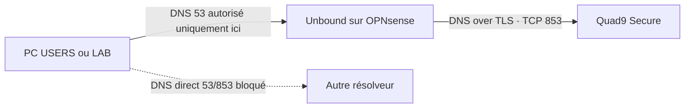

# Services réseau du socle

## Chaîne DNS

Les clients reçoivent l’adresse de leur interface OPNsense comme serveur DNS.
Unbound met les réponses en cache et envoie toutes les requêtes vers les deux
adresses du service sécurisé Quad9 :

- `9.9.9.9:853` ;
- `149.112.112.112:853` ;
- nom vérifié dans le certificat : `dns.quad9.net`.

Quad9 fournit le premier niveau de filtrage contre les domaines malveillants.
Il réalise la validation DNSSEC. Unbound agit ici comme forwarder chiffré :
sa validation DNSSEC locale reste désactivée afin de ne pas effectuer deux
validations et de ne pas créer de faux échecs.

Il n’existe aucun fallback silencieux vers le DNS Orange, Google ou un DNS en
clair. Une panne de Quad9 doit donc être visible et traitée manuellement depuis
`RESCUE`.

Les ports DNS classiques sortants sont bloqués pour les clients :

- UDP/TCP 53 vers Internet ;
- TCP 853 vers Internet.

Cela empêche le contournement simple, pas le DNS over HTTPS sur TCP 443. Bloquer
tous les DoH demanderait de gérer les postes ou de maintenir des listes
d’adresses ; ce n’est pas présenté comme garanti par le firewall seul. Un VPN
peut également utiliser son propre DNS.

## Filtrage par listes

Au premier démarrage, aucune liste publicitaire locale n’est activée. Quad9
Secure apporte déjà le filtrage de sécurité et permet de distinguer un problème
réseau d’un faux positif de liste.

Après validation du socle, une petite liste intégrée à Unbound, comme OISD
Small ou HaGeZi Light, pourra être activée uniquement pour `USERS`. `LAB` reste
sur le filtrage de sécurité Quad9 pour ne pas fausser les expériences. Chaque
ajout devra avoir :

1. une sauvegarde avant activation ;
2. une source réseau explicite ;
3. un test d’un domaine normal et d’un domaine bloqué ;
4. une procédure de désactivation.

## DHCP

Dnsmasq est utilisé uniquement comme serveur DHCP, avec son port d’écoute DNS à
`0`. Unbound reste l’unique service DNS du firewall.

| Réseau | Passerelle et DNS | Plage dynamique |
|---|---|---|
| `USERS` | `10.10.20.1` | `10.10.20.100` à `10.10.20.199` |
| `LAB-PC` | `10.10.40.1` | `10.10.40.100` à `10.10.40.199` |

Le domaine local est `home.arpa`. Les noms stables d’infrastructure seront
créés comme overrides statiques dans Unbound. Avec Dnsmasq en DHCP seul, la
résolution automatique de tous les noms de baux dynamiques n’est pas garantie ;
elle n’est pas nécessaire à la partie 1.

`RESCUE`, les réseaux réservés et les ports inutilisés n’ont pas de DHCP.

## Temps

OPNsense conserve son service NTP par défaut et ses upstreams OPNsense. Les
clients peuvent le joindre en UDP 123. La partie 1 ne bloque pas encore le NTP
direct vers Internet : tous les systèmes clients ne respectent pas une option
NTP reçue par DHCP, et casser leur horloge nuirait aussi au TLS.

L’heure correcte est indispensable avant DNS over TLS, car elle intervient
dans la vérification du certificat.
