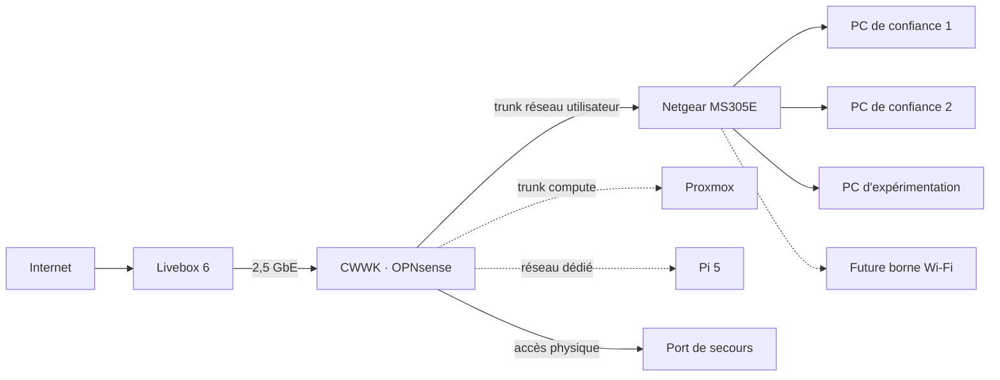

# Vue d’ensemble

## Reconstruction en trois parties

1. **Socle réseau** : Livebox, OPNsense, switch, VLAN et filtrage.
2. **Plateforme locale** : Proxmox et un premier service de test.
3. **Intégration** : observation puis capacités bornées avec Your Cloud.

Chaque partie doit rester utilisable si la suivante est absente.

## Architecture cible

Les liaisons en pointillés appartiennent aux parties ultérieures ou à un
matériel non encore intégré.

## Principes

- OPNsense route entre les zones et applique le filtrage.
- Le MS305E transporte les VLAN, mais ne décide pas des communications entre
  eux.
- Le CWWK n’est pas utilisé comme un switch logiciel : ses différents liens
  sont routés.
- Aucun service interne ne dépend du VPS pour fonctionner localement.
- Le Wi-Fi Livebox reste en dehors des VLAN internes pendant la première
  partie.
- Your Cloud ne devient pas une dépendance du routage ou de la récupération.
